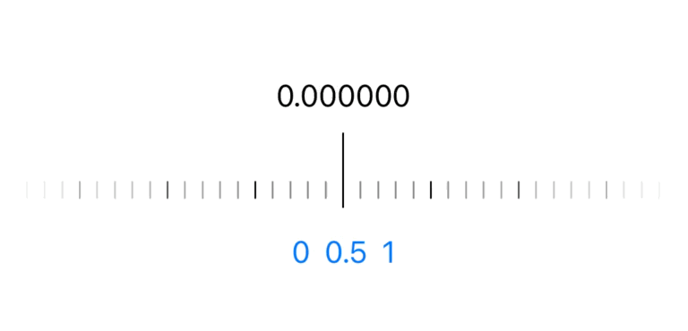

> An alternative consideration is https://github.com/shima11/SteppedSlider.

# PrecisionLevelSlider

A slider that allows the user to select a value with a high level of precision.
Not grabbing knobs but sliding reels.

<p align="center">
  
</p>

## Features

- No bundle built-in UI
- Make your design for this slider - center indicator and background design.
- Triggers haptic feedback according to value changes.
- Specialized for iOS - SwiftUI, UIKit

## Usage

### SwiftUI

```swift
SwiftUIPrecisionLevelSlider(
    value: $value,
    haptics: .init(trigger: { value in
        // trigger haptics according to the value
    }),
    range: .init(range: -45...45, transform: { $0.rounded(.toNearestOrEven) }),
    centerLevel: { value in
        // your custom view here
    },
    track: { value in
        // your custom view here
    }
)
.tint(.primary)
.frame(height: 50)
```

### UIKit

Use `PrecisionLevelSlider`
